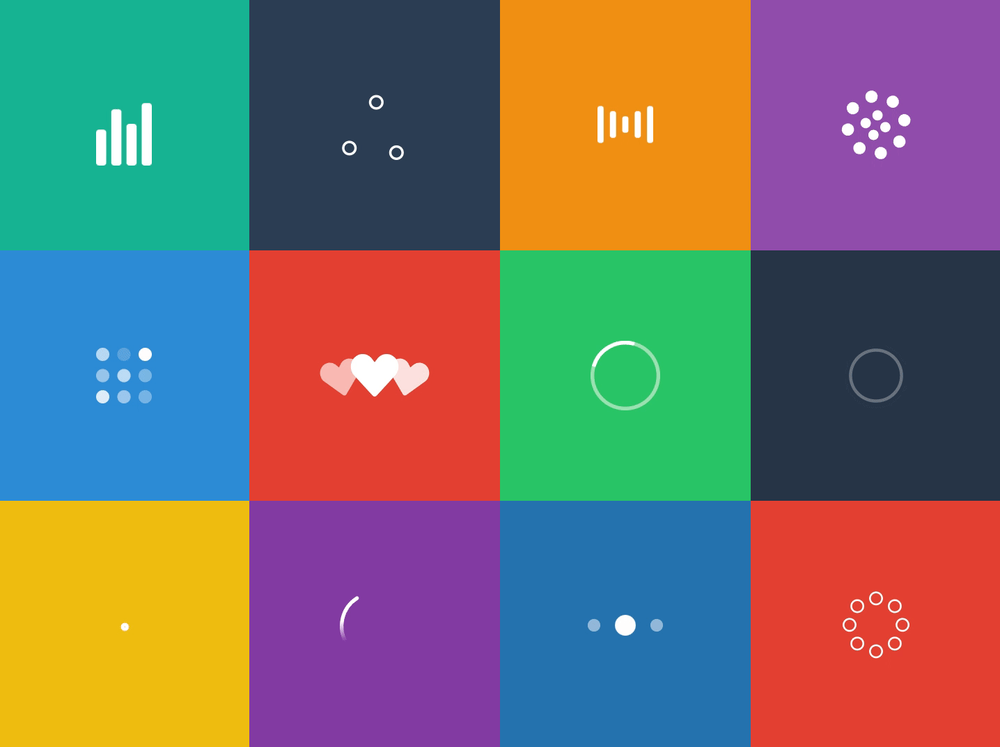

<h2 align="center">React Loading</h2>
<p align="center">
Simple and Accessible loading indicators with React.
<br />
<br />
<a href="https://www.npmjs.com/package/@agney/react-loading">
  
</a>

<br />
<a href="https://github.com/agneym/react-loading/actions">
  
</a>
<a href="https://prettier.io">
  
</a>
<a href="http://makeapullrequest.com">
  
</a>

Comes bundled with React components of [Sam Herbert's animated SVG loaders](https://github.com/SamHerbert/SVG-Loaders) in a tree shakeable package.



## Installation

```bash
npm i @agney/react-loading
# OR
yarn add @agney/react-loading
```

[Demo](https://agneym.github.io/react-loading/)

## Features

- Small Size

  The whole library is about [20kB minified](https://bundlephobia.com/result?p=@agney/react-loading). _But you would never need the whole bundle._

  The library is build to be treeshakeable that when you use one or two of the bundled loaders, you would have less than 1kB in your bundle.

- Accessibility

  Provides accessibility attributes on your loading components and containers.

  `aria-busy` is set to `true` on container on loading and progress indicators have `role=progressbar`.

- Specify a Global loader

  You probably don't want loader components mixed everywhere, so you can specify a `LoaderContext` that can be overridden later if necessary.

- Bring your own loader

  If you decide to bring your own loading indicator, library would support that as well, keeping all your logic the same.

- TypeScript support. Zero extra CSS.

## Usage

```javascript
import { useLoading, Audio } from '@agney/react-loading';

function Content() {
  const { containerProps, indicatorEl } = useLoading({
    loading: true,
    indicator: <Audio width="50" />,
  });

  return (
    {/* Accessibility props injected to container */}
    <section {...containerProps}>
      {indicatorEl} {/* renders only while loading */}
    </section>
  );
}
```

## Loaders

This library comes bundled with React components of [Sam Herbert's animated SVG loaders](https://github.com/SamHerbert/SVG-Loaders) in a tree shakeable package.

Each loader is an SVG and all props passed shall be applied to the top SVG element. All SVGs are set to inherit `currentColor` from it's parents for fill/stroke.

Available loaders are:

```javascript
import {
  Audio,
  BallTriangle,
  Bars,
  Circles,
  Grid,
  Hearts,
  Oval,
  Puff,
  Rings,
  SpinningCircles,
  TailSpin,
  ThreeDots,
} from '@agney/react-loading';
```

Only the ones you use will be included in your bundle when you use a bundler like Webpack/Rollup.

## Context

You can specify a single loading indicator reused across hooks with the `LoaderProvider`.

```javascript
import { LoaderProvider, useLoading, BallTriangle } from '@agney/react-loading';

function App() {
  const { containerProps, indicatorEl } = useLoading({
    loading: true,
  });
  return <section {...containerProps}>{indicatorEl}</section>;
}

ReactDOM.render(
  <LoaderProvider indicator={<BallTriangle width="50" />}>
    <App />
  </LoaderProvider>
);
```

You can use as many `LoaderProvider` provider elements as you like and React will pick the one closest to the hook you are rendering.

[More on React Context](https://reactjs.org/docs/context.html)

## Extra Props on Loader

If you want to provide specific props on a loader specifically when you use the hook:

```javascript
useLoading({
  loading: true,
  loaderProps: {
    // Any props here would be spread on to the indicator element.
    style: {{ margin: '0 auto' }}
  }
});
```

We also a provide a special key for `valueText`, that will be used as description for indicator:

```javascript
useLoading({
  loading: true,
  loaderProps: {
    valueText: 'Fetching video from the Great Internet',
  },
});

// now this will generate:
/* <svg role="progressbar" aria-valuetext="Fetching video from the Great Internet"></svg>*/
```

`aria-valuetext` will be read by screenreaders.

You could also provide `aria-valuenow` for indicators that display progress (but the prebundled ones are best for indeterminate progress indicators)

[MDN for Reference on `progressbar`](https://developer.mozilla.org/en-US/docs/Web/Accessibility/ARIA/ARIA_Techniques/Using_the_progressbar_role)

## Bring your own loader

Just switch the import to your own loading indicator (just make sure that it accepts props)

```javascript
import { LoaderProvider, useLoading } from '@agney/react-loading';

const Loader = ({ ...rest }) => <p {...rest}>Loading...</p>;

function App() {
  const { containerProps, indicatorEl } = useLoading({
    loading: true,
  });
  return <section {...containerProps}>{indicatorEl}</section>;
}

ReactDOM.render(
  <LoaderProvider indicator={<Loader />}>
    <App />
  </LoaderProvider>
);
```

# Contributing

All PRs welcome.

## Development

We use [`tsdx`](https://github.com/formium/tsdx) for generating boilerplate.

**Install:**

```bash
# Library
npm i

# Example
cd example && npm i
```

**Development:**

```bash
# Running library dev
npm start

# Running example
cd example && npm start
```

**Testing:**

Testing with `react-testing-library` and `jest`

```bash
npm test
```

Commands are available in detail on tsdx repository.
